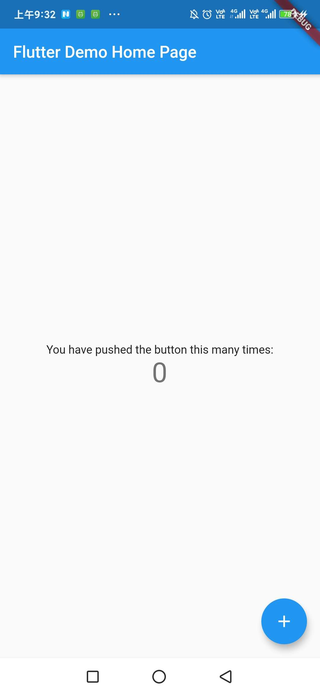

### 拆解默认应用
* [计数器示例界面](#jump2.2.1)
* [核心代码逻辑](#jump2.2.2)

#### <span id="jump2.2.1">2.2.1 计数器示例界面</span>
Flutter在创建的过程中会默认创建一个简单的计数应用，这一节我们拆解一下这个计数器应用。先看一下这个计数器应用的界面  

<div align=center></div>

功能非常简单:点一下+号按钮，界面上的数字就会加1。核心代码在lib包下的main.dart文件中。
#### <span id="jump2.2.2">2.2.2 核心代码逻辑</span>
##### main.dart源代码:
```dart
// 1.导包
import 'package:flutter/material.dart';
// 2.应用入口
void main() {
  runApp(MyApp());
}
// 3.根布局
class MyApp extends StatelessWidget {
  // This widget is the root of your application.
  @override
  Widget build(BuildContext context) {
    return MaterialApp(
      title: 'Flutter Demo',
      theme: ThemeData(
    
        primarySwatch: Colors.blue,
    
        visualDensity: VisualDensity.adaptivePlatformDensity,
      ),
      home: MyHomePage(title: 'Flutter Demo Home Page'),
    );
  }
}
// 4.首页
class MyHomePage extends StatefulWidget {
  MyHomePage({Key key, this.title}) : super(key: key);

  final String title;

  @override
  _MyHomePageState createState() => _MyHomePageState();
}
// 5.首页状态管理
class _MyHomePageState extends State<MyHomePage> {
  int _counter = 0;

  void _incrementCounter() {
    setState(() {
      _counter++;
    });
  }
  @override
  Widget build(BuildContext context) {
    return Scaffold(
      appBar: AppBar(
        title: Text(widget.title),
      ),
      body: Center(
        child: Column(
          mainAxisAlignment: MainAxisAlignment.center,
          children: <Widget>[
            Text('You have pushed the button this many times:',),
            Text(
                '$_counter',
              style: Theme.of(context).textTheme.display1,
            )
            
          ],
        ),
      ),
      floatingActionButton: FloatingActionButton(
        onPressed: _incrementCounter,
        tooltip: 'Increment',
        child: Icon(Icons.add),
      ), 
    );
  }
}
```
##### 源码拆分  
**1. 导包**
```dart
import 'package:flutter/material.dart';
```
这里导入的是Material风格的UI库，Flutter默认提供了一套丰富的MaterialUI库。关于Flutter的import导包，可以参考第三章Dart语言基础部分 [Dart导包](Dart导包.md)。  

**2. 应用入口**  
Java、C等语言都有一个入口函数，用于启动应用程序，Dart语言也不例外。mian函数就是Dart的入口函数，调用runApp来启动一个Flutter应用。
```dart
void main() {
  runApp(MyApp());
}
```

**3. 根布局**
Dart的入口函数会调用runApp函数来启动Flutter应用，这个runApp()的参数是一个Widget，这个Widget就是应用的根布局，也是一个MyApp对象。  
```dart
// 3.根布局
// StatelessWidget无状态Widget
class MyApp extends StatelessWidget {
  // This widget is the root of your application.
  @override
  Widget build(BuildContext context) {
    // MaterialApp脚手架，自带toolbar，路由、主题、国际化等配置
    return MaterialApp(
    // 标题
      title: 'Flutter Demo',
    // 全局主题配置
      theme: ThemeData(
        //全局背景色
        primarySwatch: Colors.blue,
        //状态栏和标题栏颜色
        <!-- primaryColor: Colors.blue, -->

        visualDensity: VisualDensity.adaptivePlatformDensity,
      ),
      //引入首页
      home: MyHomePage(title: 'Flutter Demo Home Page'),
    );
  }
}
```
> 1. MyApp就是我们的Flutter应用，继承自StatelessWidget，所以Flutter应用本身也是一个Widget  
> 2. 所有的Widget都通过build方法构建页面，比如配置标题、主题颜色等等，这些可以配合MaterialApp脚手架来完成

**4. MaterialApp脚手架**

MaterialApp表示要创建Material Design风格的应用，里面包含了Material Design风格的一些基本属性。  
MaterialApp脚手架的一些基本属性: 
```dart 
MaterialApp({
  Key key,
  this.title = '', // 设备用于为用户识别应用程序的单行描述
  this.home, // 应用程序默认路由的小部件,用来定义当前应用打开的时候，所显示的界面
  this.color, // 在操作系统界面中应用程序使用的主色。
  this.theme, // 应用程序小部件使用的颜色。
  this.routes = const <String, WidgetBuilder>{}, // 应用程序的顶级路由表
  this.navigatorKey, // 在构建导航器时使用的键。
  this.initialRoute, // 如果构建了导航器，则显示的第一个路由的名称
  this.onGenerateRoute, // 应用程序导航到指定路由时使用的路由生成器回调
  this.onUnknownRoute, // 当 onGenerateRoute 无法生成路由(initialRoute除外)时调用
  this.navigatorObservers = const <NavigatorObserver>[], // 为该应用程序创建的导航器的观察者列表
  this.builder, // 用于在导航器上面插入小部件，但在由WidgetsApp小部件创建的其他小部件下面插入小部件，或用于完全替换导航器
  this.onGenerateTitle, // 如果非空，则调用此回调函数来生成应用程序的标题字符串，否则使用标题。
  this.locale, // 此应用程序本地化小部件的初始区域设置基于此值。
  this.localizationsDelegates, // 这个应用程序本地化小部件的委托。
  this.localeListResolutionCallback, // 这个回调负责在应用程序启动时以及用户更改设备的区域设置时选择应用程序的区域设置。
  this.localeResolutionCallback, // 
  this.supportedLocales = const <Locale>[Locale('en', 'US')], // 此应用程序已本地化的地区列表 
  this.debugShowMaterialGrid = false, // 打开绘制基线网格材质应用程序的网格纸覆盖
  this.showPerformanceOverlay = false, // 打开性能叠加
  this.checkerboardRasterCacheImages = false, // 打开栅格缓存图像的棋盘格
  this.checkerboardOffscreenLayers = false, // 打开渲染到屏幕外位图的图层的棋盘格
  this.showSemanticsDebugger = false, // 打开显示框架报告的可访问性信息的覆盖
  this.debugShowCheckedModeBanner = true, // 在选中模式下打开一个小的“DEBUG”横幅，表示应用程序处于选中模式
}) 
```

**5. 首页**  

因为需要在首页展示数据，并且需要触发按钮的点击事件改变计数器的数值，所以需要将首页定义为有状态的组件。首页部分的核心代码:
```dart
class MyHomePage extends StatefulWidget {
  MyHomePage({Key key, this.title}) : super(key: key);
  //标题，就是上面MaterialApp脚手架的home属性中传入的“Flutter Demo Home Page”
  final String title;

  @override
  _MyHomePageState createState() => _MyHomePageState();
}
// 状态管理
class _MyHomePageState extends State<MyHomePage> {
  //计数器变量
  int _counter = 0;
  //定义一个方法，用于触发点击事件时更新变量值
  void _incrementCounter() {
    setState(() {
      _counter++;
    });
  }

  @override
  Widget build(BuildContext context) {
    //一个布局容器，用于绘制界面上的UI元素
    return Scaffold(
      appBar: AppBar(
        //titile的值通过MyHomePage的构造方法传递过来
        title: Text(widget.title),
      ),
      body: Center(
        child: Column(
          mainAxisAlignment: MainAxisAlignment.center,
          children: <Widget>[
            Text('You have pushed the button this many times:',),
            Text(
                '$_counter',
              style: Theme.of(context).textTheme.display1,
            )
            
          ],
        ),
      ),
      //悬浮按钮
      floatingActionButton: FloatingActionButton(
        onPressed: _incrementCounter,
        tooltip: 'Increment',
        child: Icon(Icons.add),
      ),
    );
  }
```
> 1. MyHomePage是一个有状态部件，有状态意味着界面UI会发生变化，所以需要在其内部定义能够影响其状态变化的字段，并且字段应该使用final修饰。
> 2. 每次调用setState方法后都会自动重新调用build方法构建界面，给界面上的元素重新赋值。
> 3. Scaffold也是一个脚手架，这个脚手架是一个布局容器，使用这个脚手架可以构建出app的基本界面。  

Scaffold脚手架包含以下属性:  
```dart
class Scaffold extends StatefulWidget {
  /// Creates a visual scaffold for material design widgets.
  const Scaffold({
    this.appBar,//顶部标题栏
    this.body,//主要显示区域
    this.floatingActionButton, //Material Design风格的悬浮按钮
    this.floatingActionButtonLocation,//悬浮按钮的位置
    this.floatingActionButtonAnimator,//悬浮按钮的动画效果
    this.persistentFooterButtons,
    this.drawer,//左侧侧滑菜单
    this.endDrawer,//右侧侧滑
    this.bottomNavigationBar,//底部导航
    this.bottomSheet,//底部滑出的组件
    this.backgroundColor,//背景色
    this.resizeToAvoidBottomPadding,//已弃用，使用resizeToAvoidBottomInset
    this.resizeToAvoidBottomInset,//bool值，重新计算布局控件大小
    this.primary = true,//是否拓展
    this.drawerDragStartBehavior = DragStartBehavior.start,
    //如果为真，并且指定了[bottom navigationbar]或[persistentFooterButtons]
    //body区域的底部将拓展到脚手架的底部，而不是bottom navigationbar]
    //或[persistentFooterButtons]的顶部
    this.extendBody = false,

    //如果为真，并且指定了一个[appBar]，那么[body]的高度将被扩展，
    //包括app bar的高度，并且body的顶部与app bar的顶部对齐。
    this.extendBodyBehindAppBar = false,
    this.drawerScrimColor,//侧滑布局滑出去之后剩余部分的颜色
    this.drawerEdgeDragWidth,//横向侧滑可以打开的区域宽度，默认值20，除了0之外其他都不起作用
    this.drawerEnableOpenDragGesture = true,//通过手势滑动打开左侧侧滑栏
    this.endDrawerEnableOpenDragGesture = true,//通过手势滑动打开右侧侧滑栏
  })
}
```